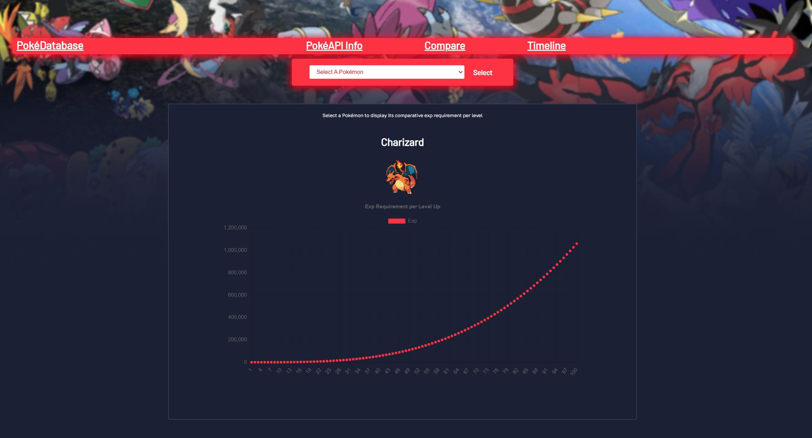

# PokéDataBase
### _The last Pokémon catalogue you'll ever need!_

 

## 🔥 About the Project:
#### Cameron Godwin (Author) Interactive Development 200 Term 1

Hi! This is a second year development webapp - (website) project for Open Window created in React that explores the PokéAPI by displaying dynamic data using Charts2js

### Built With:

[&nbsp;&nbsp;&nbsp;&nbsp;&nbsp;&nbsp;&nbsp;&nbsp;](https://html.org/)[&nbsp;&nbsp;&nbsp;&nbsp;&nbsp;&nbsp;&nbsp;&nbsp;](https://html.org/)[&nbsp;&nbsp;&nbsp;&nbsp;&nbsp;&nbsp;&nbsp;&nbsp;](https://www.php.net/docs.php) &nbsp;&nbsp;&nbsp;&nbsp;&nbsp;&nbsp;&nbsp;&nbsp;

# 🎓 What you'll need to run the webapp:

For this app you're going to need the following installed on your system.

* Visual Studio Code
* Node.js

### Download:

Download and unzip the main Github code file in a location of your choosing, then open the file in Visual Studio Code by either drag and dropping or opening the directory through the VSCode interface.

### Creating and running the app:

Once you have the files downloaded and opened in VSCode, open up the terminal by either using the hotkeys `Ctrl + ~` or by clicking the Terminal - New Terminal tab at the top of VSCode.

 

next you'll want to make sure your terminal is displaying the correct directory `C:\Users\[your install location]\PokéDataBase` and then run the following commands in the terminal:

1. ### `npm i` 
wait till this finishes, the download should take between 5 to 20 mins depending on your connection speed.

2. ### `npm start`

Before you know it, the web Development server will launch in your default browser of choice! Showing off the _PokéDatabase_!

# 🚀 Features:

PokéDatabase displays numerous sets of data from the official PokéAPI, information displayed includes:
* Combat stats and values of each Pokémon
* Official artwork and sprites of each Pokémon
* ID's and types of each Pokémon
* Comprehensive comparason between Pokémon stats

This webapp does not display some of the data from the PokéAPI, it excludes but is not limited to:

❌Names of Pokémon in other languages, ❌Pokémon idecies, ❌Species and other information present in the Pokémon games

# 📸 Screenshots:

### -> Home/Landing page:

### -> Comparing Pokémon and their stats:

### -> Pokémon Info and Stats:

### -> Pokémon Exp growth timeline:

#  🎥 Video Demonstration:

[View Demonstration](./Demo/video.mp4)

<!-- AUTHORS -->

## Author:
- **Cameron Godwin** - [Github](https://github.com/GodwinCameron)

<!-- LICENSE -->

## License:

Distributed under the MIT License. See `LICENSE` for more information.\

<!-- LICENSE -->

## Contact:
**Cameron Godwin** - [200109@virtualwindow.co.za](mailto:200109@virtualwindow.co.za) 
- **Project Link** - https://github.com/GodwinCameron/2023-DV200-Term2-Hospicare

<!-- ACKNOWLEDGEMENTS -->

## Acknowledgements:

- [Figma](https://www.figma.com/)
- [Lecturer](https://github.com/Tsungai)
- [Flexy Boxes](https://the-echoplex.net/flexyboxes/)
- [PokéApi](https://pokeapi.co/)